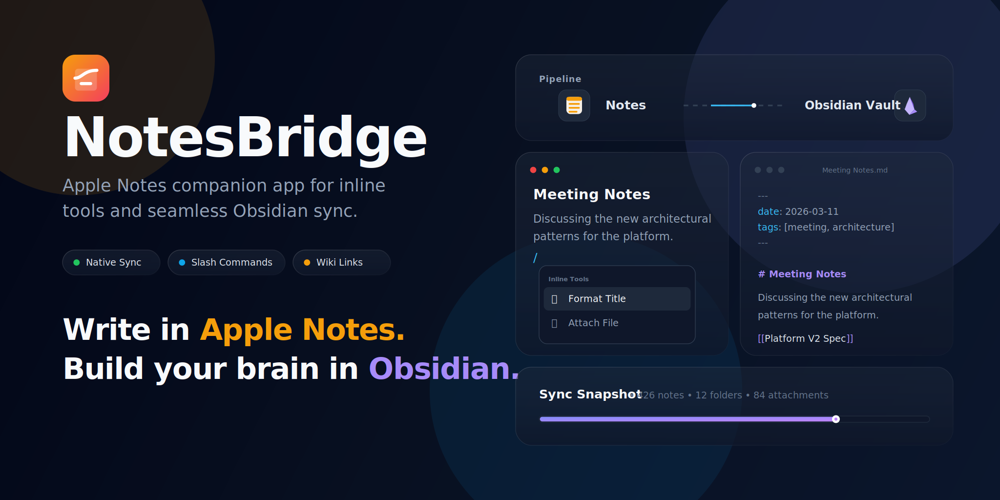

# NotesBridge

[English](./README.md) | [简体中文](./README.zh-CN.md) | [Français](./README.fr.md)

[](https://github.com/peizh/NoteBridge/actions/workflows/ci.yml)
[](https://github.com/peizh/NoteBridge/stargazers)
[](https://github.com/peizh/NoteBridge/network/members)
[](./LICENSE)



> Ce document peut être légèrement en retard par rapport à la version anglaise.

Transformez les notes Apple partagées en fichiers et dossiers Markdown locaux, prêts à être conservés, recherchés, versionnés et utilisés avec des agents IA.

## État du projet

NotesBridge est en développement actif. C'est une application compagnon macOS pensée pour les personnes qui reçoivent ou organisent des notes dans Apple Notes, mais veulent conserver la source de vérité à long terme sous forme de fichiers et dossiers Markdown locaux.

La version distribuée directement se concentre aujourd'hui sur deux objectifs :

- ajouter des outils d'édition Apple Notes en ligne, comme les slash commands et les déclencheurs de style Markdown
- synchroniser Apple Notes vers un espace local-first de type Obsidian, avec dossiers, pièces jointes, front matter et liens internes préservés

Apple Notes est très pratique pour les notes partagées avec la famille et les amis. NotesBridge transforme cette matière partagée en un espace Markdown plus simple à organiser, automatiser, versionner et faire exploiter par des agents IA.

Si vous utilisez déjà Apple Notes pour la capture et Obsidian pour l'organisation à long terme, NotesBridge est conçu pour ce flux de travail.

## Pourquoi l'essayer

- Conserver la structure Apple Notes sous forme de vrais fichiers et dossiers Markdown.
- Préserver les pièces jointes natives, les scans exportés, les tableaux et les liens internes entre notes.
- Rendre les notes synchronisées plus simples à rechercher, versionner et traiter avec des agents IA.
- Utiliser des slash commands et des outils de mise en forme directement au-dessus d'Apple Notes.
- Fonctionner comme une application légère de barre de menus, sans remplacer votre flux de prise de notes.

## Démarrage rapide

1. Téléchargez la dernière version direct-download depuis [Releases](https://github.com/peizh/NoteBridge/releases).
2. Déplacez `NotesBridge.app` dans `/Applications`.
3. Lancez l'application et accordez les autorisations macOS demandées.
4. Choisissez votre dossier de données Apple Notes lors de la première synchronisation complète.
5. Commencez à synchroniser vers votre coffre Obsidian.

## Ce que fait actuellement ce prototype

- Fonctionne comme une application compagnon dans la barre de menus avec une fenêtre de réglages légère.
- Surveille Apple Notes lorsqu'il est au premier plan et que l'éditeur a le focus.
- Affiche une barre d'outils de mise en forme flottante au-dessus du texte sélectionné dans les builds pris en charge.
- Convertit les déclencheurs Markdown / listes en début de ligne en commandes de formatage natives Apple Notes.
- Prend en charge les slash commands, avec exécution immédiate des commandes exactes et menu flottant de suggestions.
- Synchronise Apple Notes vers un coffre Obsidian avec métadonnées front matter et export natif des pièces jointes.

## Contraintes produit

Apple Notes n'expose aucune API publique de plugin ou d'extension. NotesBridge se comporte donc comme une application compagnon plutôt que comme une véritable extension intégrée à Notes.

L'implémentation actuelle reste volontairement prudente :

- Les améliorations en ligne dépendent d'Accessibility et de la synthèse d'événements ; la version distribuée directement est donc le principal véhicule pour l'expérience complète.
- La variante App Store peut être simulée avec `NOTESBRIDGE_APPSTORE=1`, ce qui désactive les améliorations Apple Notes en ligne tout en laissant les réglages et la synchronisation actifs.
- Le sens principal de synchronisation reste Apple Notes -> Obsidian.
- La navigation clavier du menu slash command peut nécessiter Input Monitoring ; si l'interception n'est pas disponible, les commandes exactes suivies d'un espace et la sélection à la souris restent utilisables.
- La synchronisation complète demande de choisir le dossier macOS `group.com.apple.notes` afin que NotesBridge puisse lire directement la base de données Apple Notes et les fichiers binaires des pièces jointes.

## Construire et lancer

```bash
./scripts/run-bundled-app.sh
```

C'est le point d'entrée recommandé pour le développement. Il construit l'exécutable SwiftPM, l'enveloppe dans une `NotesBridge.app` signée et lance l'application depuis `~/Library/Application Support/NotesBridge/NotesBridge.app`.

L'application bundle utilise désormais une exigence désignée stable, afin que les autorisations Accessibility et Input Monitoring restent attachées après les recompilations. Si vous aviez autorisé une ancienne version de NotesBridge et que l'application affiche encore `Required`, supprimez l'ancienne entrée dans Réglages Système puis ajoutez à nouveau l'application bundle actuelle.

Pour un lancement rapide sans bundle, vous pouvez toujours utiliser :

```bash
swift run
```

Mais `swift run` lance un exécutable nu ; les flux d'autorisation macOS qui dépendent d'un vrai bundle d'application, en particulier Input Monitoring pour la navigation clavier du menu slash, ne fonctionneront pas correctement dans ce mode.

Si vous souhaitez seulement reconstruire l'application `.app` sans la lancer :

```bash
./scripts/run-bundled-app.sh --build-only
```

Au premier lancement en mode bundle, macOS peut demander les autorisations Accessibility et Automation afin que NotesBridge puisse observer Apple Notes et synchroniser son contenu. La première synchronisation complète vous demandera aussi de choisir `~/Library/Group Containers/group.com.apple.notes`, afin que l'application puisse lire `NoteStore.sqlite` et les pièces jointes binaires.

## Prochaines étapes suggérées

1. Renforcer l'ancrage de sélection, le positionnement du menu slash et celui de la barre de formatage sur plusieurs écrans et dans les espaces plein écran.
2. Ajouter un index de synchronisation plus riche et un suivi incrémental des changements de notes afin de réduire le travail inutile lors des exports complets.
3. Finaliser une chaîne de distribution directe réellement signée et notarized, puis décider si un vrai livrable App Store mérite d'être maintenu séparément.

## License

MIT. Voir [LICENSE](./LICENSE).
